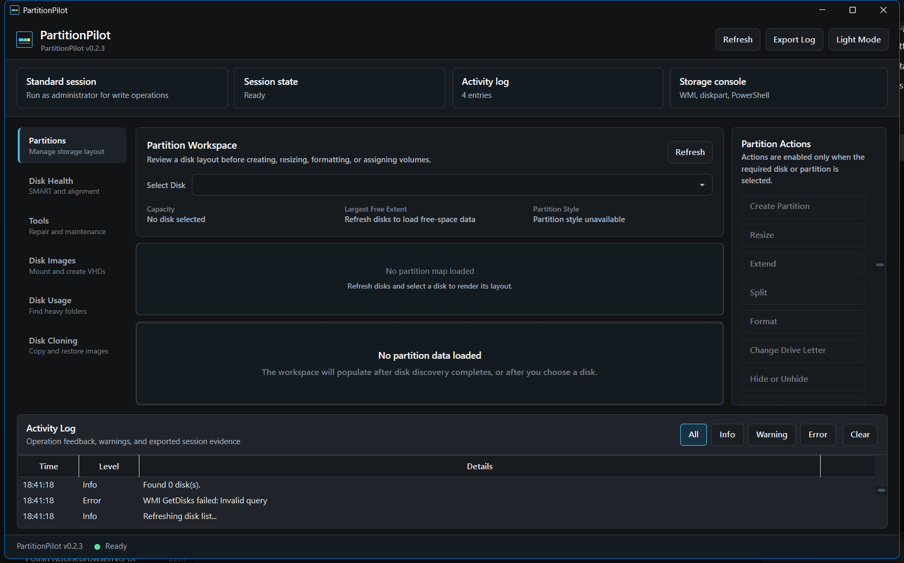

# PartitionPilot

PartitionPilot is a Windows disk partition management tool for power users and IT administrators. It provides a WPF interface for partition operations, disk health checks, maintenance tools, and disk image workflows.



## Features

- Partition overview with disk map, partition table, and contextual actions.
- Pending operations queue: partition changes are queued and previewed before applying.
- Partition snapshot history with JSON export, mismatch-checked recovery plans, and guided recovery notes.
- Create, delete, format, resize, extend, split, hide, and drive-letter operations.
- Disk initialization for RAW/unpartitioned disks (GPT).
- Extended SMART health monitoring via LibreHardwareMonitorLib: reallocated sectors, pending sectors, power cycles, total writes, NVMe available spare, NVMe media errors, and vendor-specific attributes.
- 4K alignment review and disk health classification (Good/Warning/Critical).
- BitLocker encryption status with mutation and destruction preflights.
- Storage Spaces pool detection with integrity warnings on pooled disks.
- Unsupported partition type identification (Linux, LUKS, HFS+, APFS) with guarded actions.
- Maintenance tools: MBR to GPT conversion, filesystem repair, optimization/TRIM, secure wipe (single-pass, DoD 3-pass, DoD 7-pass, NVMe sanitize), boot repair, surface test, Dev Drive creation, and DiskSpd-backed benchmarking.
- Benchmark result export as JSON or text with drive metadata.
- Disk image workflows for mounting, dismounting, and creating VHD/VHDX images.
- Disk usage analysis with squarified treemap visualization and top-folder size breakdown.
- Disk cloning: create and restore WIM/VHDX images.
- Privacy-preserving support bundle export (redacted serial numbers and user paths).
- Structured native-command audit records with path redaction.
- Auto-updates via Velopack with delta packages and GitHub Releases integration.
- Dark and light theme with persistent preference.
- Activity log with export, filtering, and auto-save.
- Cancellable long-running operations with progress and rate reporting.
- Screen reader accessibility (AutomationProperties on all interactive controls).
- Administrator Protection compatible (ProgramData-based data paths).
- CI pipeline with SHA256SUMS and GitHub artifact attestations for unsigned release provenance.

## Requirements

- Windows 10 or Windows 11.
- Administrator privileges for disk operations.
- .NET 10 SDK to build from source.

## Build

```powershell
dotnet build .\src\PartitionPilot\PartitionPilot.csproj -m:1
```

The project targets `net10.0-windows` and publishes as a self-contained Windows x64 app.

## Run

```powershell
dotnet run --project .\src\PartitionPilot\PartitionPilot.csproj
```

For real disk operations, run the built executable from an elevated session so Windows storage APIs and native tools have the required permissions.

## Safety

Partition operations are queued and previewed before execution. Verify the selected disk, partition, and pending operations before clicking Apply. Keep current backups before resizing, formatting, deleting, or wiping disks.

## License

MIT. See [LICENSE](LICENSE).
