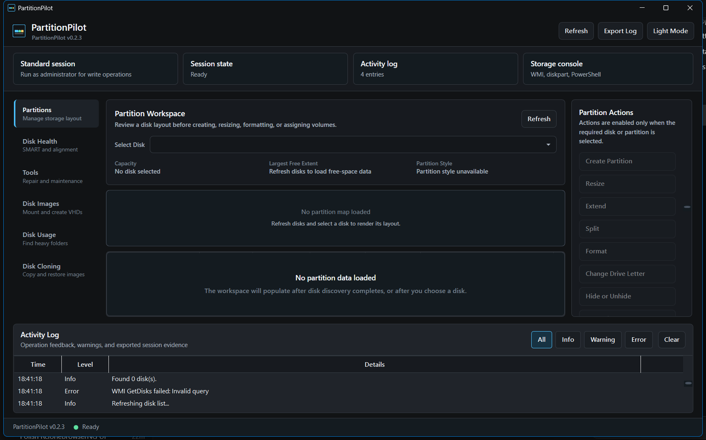

# PartitionPilot

PartitionPilot is a Windows disk partition management tool for power users and IT administrators. It provides a WPF interface for partition operations, disk health checks, maintenance tools, and disk image workflows.



## Features

- Partition overview with disk map, partition table, and contextual actions.
- Pending operations queue: partition changes are queued and previewed before applying.
- Partition snapshot history with JSON export, mismatch-checked recovery plans, and one-step restore of a captured partition table (dry-run by default, blocked on any disk-identity mismatch).
- Required pre-destruction partition snapshots before image restore, sector clone, whole-disk wipe, DoD wipe, and NVMe sanitize workflows.
- Lost-partition recovery scanning with fast boundary probes, resumable deep mode, duplicate candidate coalescing, and coverage reporting.
- Create, delete, format, resize, extend, split, hide, and drive-letter operations.
- Disk initialization for RAW/unpartitioned disks (GPT).
- Extended SMART health monitoring via LibreHardwareMonitorLib: curated SATA/NVMe advisory metadata, reallocated sectors, pending sectors, power cycles, total writes, NVMe available spare, NVMe media errors, and vendor-specific attributes with raw fallback.
- 4K alignment review and disk health classification (Good/Warning/Critical).
- BitLocker encryption status with mutation and destruction preflights.
- Storage Spaces pool detection with integrity warnings on pooled disks.
- Unsupported partition type identification (Linux, LUKS, HFS+, APFS) with guarded actions.
- Shared filesystem capability policy blocks unsupported create, format, resize, extend, check, and label operations before native disk tools run.
- Maintenance tools: MBR to GPT conversion, filesystem repair, optimization/TRIM, secure wipe (single-pass, DoD 3-pass, DoD 7-pass, NVMe sanitize), boot repair, surface test, Dev Drive creation, and DiskSpd-backed benchmarking.
- Benchmark result export as JSON or text with drive metadata.
- Disk image workflows for mounting, dismounting, and creating VHD/VHDX images.
- Disk usage analysis with squarified treemap visualization and top-folder size breakdown.
- Disk cloning: create and restore WIM/VHDX images.
- Point-in-time volume image capture from a VSS shadow copy, created through the `Win32_ShadowCopy` WMI class so it works on Windows 10 and 11 client editions, with a writer-health preflight and explicit degraded-mode confirmation if a snapshot cannot be taken.
- Disk image sidecar manifests with image SHA256, source-volume evidence, sampled source file hashes, encrypted-image rebinding, and restore-time validation before target clearing.
- Post-restore and post-clone bootability audit for Windows targets, with BCD/WinRE checks and a non-destructive repair plan.
- Privacy-preserving support bundle export (redacted serial numbers and user paths).
- Core workflow services centralize image preflight, support-bundle assembly, layout-plan generation, wipe prompts, and clone confirmations for GUI/CLI parity.
- Structured native-command audit records with path redaction.
- Auto-updates via Velopack with delta packages and GitHub Releases integration.
- Release artifact verification with SHA256 manifests, optional Authenticode signing, and explicit unsigned local-test status.
- Release-gated UI smoke tests with TRX logs, screenshots, and fail-closed all-skipped detection.
- WinPE rescue profile packaging with portable CLI launchers, source validation, and `diagnostics --rescue` checks for WMI, DiskPart, DISM, BitLocker, and storage APIs.
- .NET 10 Fluent theme with dark, light, and system (follows OS setting) modes.
- CLI companion (pp.exe) for scripted disk management with JSON output.
- SMART attribute history tracking with trend alerts for degradation detection.
- smartctl diagnostics with path/version reporting, remediation, and disk-aware self-test gating for physical, NVMe, and USB bridge modes.
- Real-time disk temperature monitoring with configurable threshold alerts.
- MFT-direct NTFS scanning for near-instant disk usage analysis.
- Sector-level disk-to-disk clone with progress reporting and cancel support.
- XAML localization resources with pseudo-locale coverage for visible labels and automation names.
- Activity log with export, filtering, and auto-save.
- Cancellable long-running operations with progress and rate reporting.
- Screen reader accessibility (AutomationProperties on all interactive controls).
- Administrator Protection compatible (ProgramData-based data paths).
- Local release packaging for self-contained Windows builds and installer artifacts.

## No Kernel Driver

PartitionPilot installs no kernel driver. Drive health comes from documented Windows storage IOCTLs: NVMe SMART log page 02h and the ATA Device Statistics log, both read through `IOCTL_STORAGE_QUERY_PROPERTY`, which is defined with `FILE_ANY_ACCESS` and so needs no elevation for health data.

It does reference LibreHardwareMonitorLib for extended vendor attributes, and that library can load a kernel driver. It does not here: the driver is used by its CPU, GPU and motherboard sensor code, and PartitionPilot enables only the storage category, which is built on ordinary Windows APIs. Verified by decompiling the shipped 0.9.6 assembly rather than assumed.

This matters because the hardware-monitoring driver most such tools load, WinRing0, carries an unpatched vulnerability (CVE-2020-14979) and has been flagged by Microsoft Defender since March 2025.

## Requirements

- Windows 10 or Windows 11.
- Administrator privileges for disk operations.
- .NET 10 SDK to build from source.

## Build

```powershell
dotnet build .\src\PartitionPilot\PartitionPilot.csproj -m:1
```

The project targets `net10.0-windows` and publishes as a self-contained Windows app. Release artifacts are built locally.

```powershell
dotnet publish .\src\PartitionPilot\PartitionPilot.csproj -c Release -r win-x64 --self-contained true
dotnet publish .\src\PartitionPilot.Cli\PartitionPilot.Cli.csproj -c Release -r win-x64 --self-contained true
dotnet run --project .\src\PartitionPilot.Cli\PartitionPilot.Cli.csproj -- release-manifest --artifacts .\artifacts
dotnet run --project .\src\PartitionPilot.Cli\PartitionPilot.Cli.csproj -- rescue-profile --source .\src\PartitionPilot.Cli\bin\Release\net10.0-windows\win-x64\publish --output .\artifacts\rescue-profile
```

Set `PARTITIONPILOT_SIGN_CERT_THUMBPRINT` before `release-manifest` to Authenticode-sign `.exe` artifacts with `signtool.exe`; without it, manifests are marked `UnsignedLocalTest`.

Run release UI smoke tests from an interactive desktop session:

```powershell
.\tools\run-ui-smoke.ps1
```

The gate builds the WPF app, runs simulation-mode FlaUI smoke tests, writes `artifacts\ui-smoke\ui-smoke.trx`, and saves failure screenshots under `artifacts\ui-smoke\screenshots`. Noninteractive verification must opt in to skipped UI tests with `-AllowHeadlessSkip`; without that flag, an all-skipped run fails the release gate.

## Run

```powershell
dotnet run --project .\src\PartitionPilot\PartitionPilot.csproj
```

For real disk operations, run the built executable from an elevated session so Windows storage APIs and native tools have the required permissions.

## CLI

```powershell
dotnet run --project .\src\PartitionPilot.Cli\PartitionPilot.Cli.csproj -- disks
dotnet run --project .\src\PartitionPilot.Cli\PartitionPilot.Cli.csproj -- partitions --disk 0
dotnet run --project .\src\PartitionPilot.Cli\PartitionPilot.Cli.csproj -- health --json
```

Commands: `disks`, `partitions`, `volumes`, `smart`, `smart-history`, `smart-trends`, `health`, `alignment`, `temperature`, `benchmark`, `snapshot`, `restore-snapshot`, `shrink-blockers`, `clone`, `wipe`, `diagnostics`, `boot-audit`, `plan`, `apply-layout`, `recovery-scan`, `release-manifest`, `rescue-profile`, `version`. All support `--json` for scripted automation.

### Exit codes

Every command returns a code a script can branch on, and `--json` produces a JSON error object on the failure path as well as the success path.

| Code | Meaning |
| --- | --- |
| 0 | Success |
| 1 | The operation ran and failed; a destructive target may be partially written |
| 2 | Completed with warnings, such as a clone that found bad sectors or failed verification |
| 3 | Usage error: missing or invalid arguments |
| 4 | Target not found |
| 5 | Precondition failed, such as an unreadable or empty input file |
| 6 | Blocked by a safety guard before anything was written |
| 7 | Cancelled at the confirmation prompt |

Codes 3 to 7 all mean nothing was changed. Code 1 is the one that means a destructive operation may have got partway through.

## Why a Volume Will Not Shrink

`pp shrink-blockers --drive C` explains the shrink floor. Windows records a Defrag event 259 in the Application log after every shrink analysis, naming the last unmovable file, its last cluster and the offset the shrink wanted to reach, and never shows it. This reads that record, classifies the blocker, states how much space it is holding back, and gives the remedy.

Recognised blockers: shadow copy storage, the page and swap files, the hibernation file, the NTFS change journal, the Windows Search index, and NTFS metadata that cannot move while the volume is mounted.

Reading the log needs no elevation, but Windows must have attempted a shrink at least once for there to be a record. The resize dialog shows the same detail when a floor is in effect.

## Restoring a Partition Table

`pp restore-snapshot --file snapshot.json --disk N` rebuilds a disk's partition table from a snapshot captured earlier. It prints a dry-run plan by default; add `--apply` to execute, which then requires typing `YES`.

The restore clears the target disk and recreates every partition at its recorded offset, size, filesystem, label and drive letter. Guards that run before any DiskPart command:

- The snapshot's disk identity must still match the target. A changed serial, unique ID, path or size blocks the restore and names the field that differs.
- Every partition must record a filesystem. An unelevated capture often leaves this blank, and recreating an EFI System Partition as NTFS leaves the machine unbootable, so the restore refuses rather than guessing. Recapture the snapshot from an elevated session.

Restoring a layout does not restore file contents. Boot, system and recovery partitions come back empty and are listed explicitly in the plan; repair boot files afterwards or restore from a disk image.

Recovery scans default to fast mode:

```powershell
pp recovery-scan --disk 1 --mode fast
pp recovery-scan --disk 1 --mode deep --state C:\ProgramData\PartitionPilot\recovery\scan-disk1.json
```

## Layout Specs

`pp apply-layout --file layout.json --disk N` reads a declarative JSON layout and prints a dry-run plan by default. Add `--apply` to execute the plan. Add `--replace` only when the current disk layout intentionally differs from the spec and the disk should be cleared and recreated.

```json
{
  "Style": "GPT",
  "TargetDisk": {
    "DiskNumber": 2,
    "FriendlyName": "Contoso USB SSD",
    "Size": 1024209543168,
    "PartitionStyle": "GPT",
    "UniqueId": "5000C500AABBCCDD",
    "SerialNumber": "SN123456",
    "Path": "\\\\?\\scsi#disk&ven_contoso",
    "BusType": "USB",
    "Location": "Port_#0004.Hub_#0001"
  },
  "Partitions": [
    {
      "SizeMB": "131072",
      "FileSystem": "NTFS",
      "Label": "System",
      "DriveLetter": "S"
    },
    {
      "UseMaximumSize": true,
      "FileSystem": "exFAT",
      "Label": "Data",
      "DriveLetter": "D"
    }
  ]
}
```

Rules enforced before DiskPart runs:

- `Style` must be `GPT` or `MBR`.
- Each partition must either set a positive whole-number `SizeMB` or set `UseMaximumSize: true`, not both.
- Filesystems are validated through the shared capability policy; unsupported create targets such as APFS are rejected before native tools run.
- `Label` is sanitized with the same label policy used by CLI plans.
- `DriveLetter` must be a single `A`-`Z` letter, with or without a trailing colon.
- `TargetDisk` is optional, but when present it must still match the current disk number, size, and stable identity fields. Use `pp disks --json` to capture the current identity block.

## Encrypted Images

PartitionPilot encrypted disk images are normal captured `.wim` or `.vhdx` files wrapped with a `.enc` suffix. Current writes use the chunked `PPENC2` container:

- AES-256-GCM with PBKDF2-SHA256 key derivation, 600,000 iterations, a 16-byte salt, 12-byte per-chunk nonces, and 16-byte authentication tags.
- Default plaintext chunks are 4 MiB; the encrypted header records chunk size and original plaintext length.
- Chunk authentication binds the container magic, plaintext length, chunk size, chunk index, and chunk length.
- Restores still read legacy `PPENC1` whole-file encrypted images for compatibility.
- A sidecar manifest is written next to the image as `<image>.ppmanifest.json`; encrypted captures rebind the manifest to the `.enc` file hash and keep the original plaintext hash as `PlainImageSha256`.

Restore behavior is fail-closed for mismatched image hashes. Missing or unreadable manifests, or plaintext hash mismatches after decrypting an encrypted image, require an explicit degraded-mode confirmation before the target disk can be cleared.

## Recovery Scan Modes

`pp recovery-scan` is read-only. It scans raw disk sectors for filesystem signatures and reports candidate partitions without changing the partition table.

- `--mode fast` probes common boot and alignment offsets, including legacy sector starts and 1 MiB boundaries. Use it first for quick triage.
- `--mode deep` scans every 512-byte sector, checkpoints progress, and can take hours on large disks.
- Deep scans default their resume file to `C:\ProgramData\PartitionPilot\recovery\recovery-scan-diskN.json`; pass `--state path` to use a specific file.
- Ctrl+C during deep mode saves resume state and exits with code 130. Resume with the command printed by the CLI.
- Completed deep scans remove their resume file automatically.
- Reports include scan mode, checked-offset count, coverage bytes and percent, completion status, resume path, candidate filesystem, offset, estimated size, confidence, and details.

## Release Verification

PartitionPilot ships self-contained, so it carries its own copy of the .NET runtime. Patching the machine's shared runtime does nothing for an installed copy: a runtime security fix only reaches users when the app is republished against the new runtime. Republish and cut a release after each .NET servicing update, and record the bundled runtime version in the release notes.

PartitionPilot releases are built locally. A release candidate needs fresh published GUI and CLI folders, a Velopack package set, and release manifests. The Velopack assets are what the built-in updater reads, so every release must ship the full `.nupkg` and `releases.win.json` alongside the setup executable:

```powershell
dotnet publish .\src\PartitionPilot\PartitionPilot.csproj -c Release -r win-x64 --self-contained true
dotnet publish .\src\PartitionPilot.Cli\PartitionPilot.Cli.csproj -c Release -r win-x64 --self-contained true
Copy-Item .\src\PartitionPilot.Cli\bin\Release\net10.0-windows\win-x64\publish\pp.exe .\src\PartitionPilot\bin\Release\net10.0-windows\win-x64\publish\
Copy-Item .\src\PartitionPilot.Cli\bin\Release\net10.0-windows\win-x64\publish\pp.pdb .\src\PartitionPilot\bin\Release\net10.0-windows\win-x64\publish\
vpk download github --repoUrl https://github.com/SysAdminDoc/PartitionPilot -o .\artifacts\velopack
vpk pack -u PartitionPilot -v {version} -p .\src\PartitionPilot\bin\Release\net10.0-windows\win-x64\publish -e PartitionPilot.exe --packTitle PartitionPilot --packAuthors SysAdminDoc --icon .\src\PartitionPilot\Assets\AppIcon.ico -o .\artifacts\velopack
.\src\PartitionPilot.Cli\bin\Release\net10.0-windows\win-x64\publish\pp.exe rescue-profile --source .\src\PartitionPilot.Cli\bin\Release\net10.0-windows\win-x64\publish --output .\artifacts\rescue-profile
.\tools\run-ui-smoke.ps1
```

`vpk pack` writes the setup executable, a portable zip, the full update package, and `releases.win.json` into `.\artifacts\velopack`. Upload the setup (renamed to `PartitionPilot-{version}-Setup.exe`), the `-full.nupkg` under its exact generated name, `releases.win.json`, and `RELEASES` to the GitHub release. Installed copies read `releases.win.json` from the latest release, so a release without it is invisible to the updater. `pp.exe release-manifest --artifacts .\artifacts` is still available to write `SHA256SUMS` files and Authenticode-sign executables when `PARTITIONPILOT_SIGN_CERT_THUMBPRINT` is set; unsigned builds are marked `UnsignedLocalTest`.

## Safety

Partition operations are queued and previewed before execution. Verify the selected disk, partition, and pending operations before clicking Apply. Keep current backups before resizing, formatting, deleting, or wiping disks.

## License

MIT. See [LICENSE](LICENSE).
