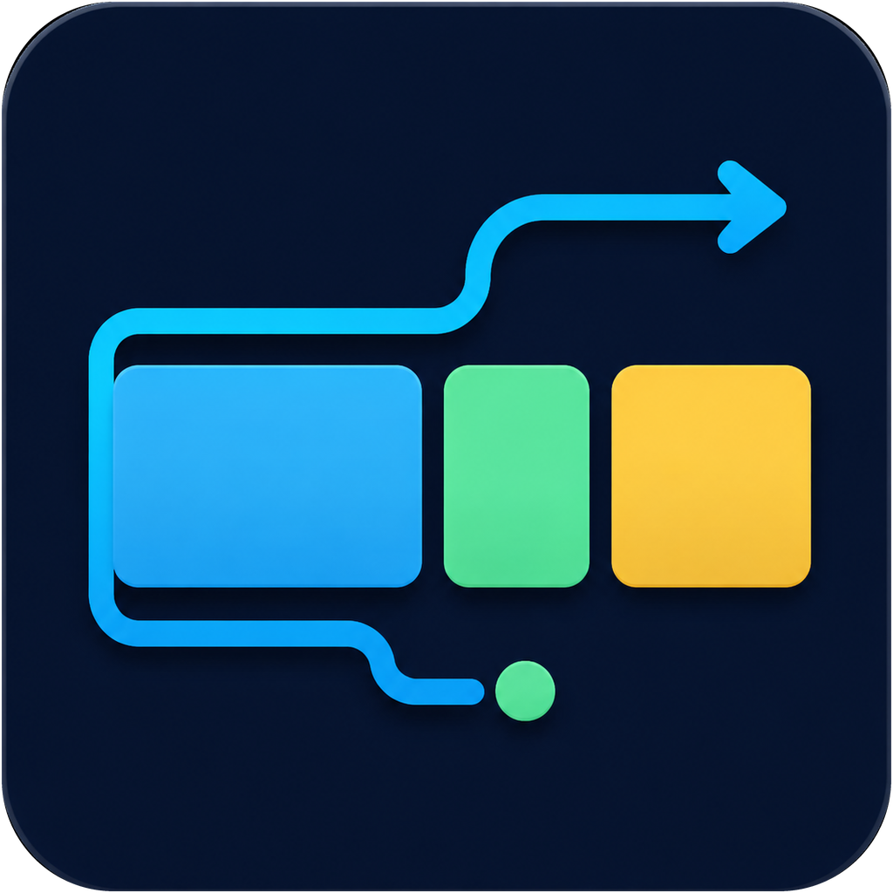
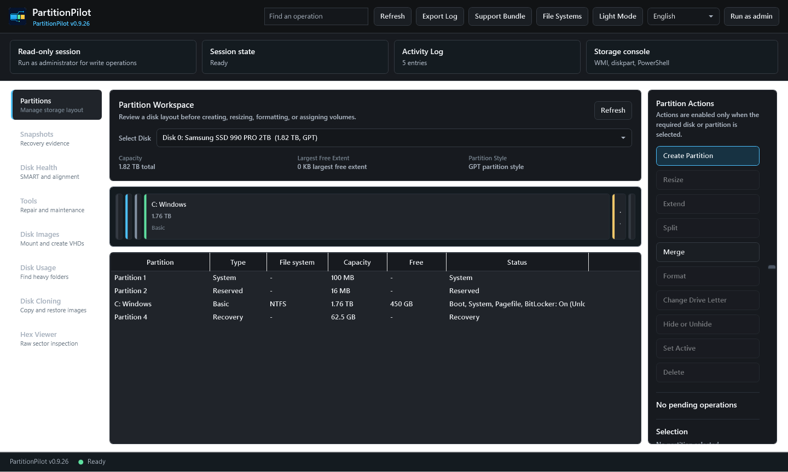
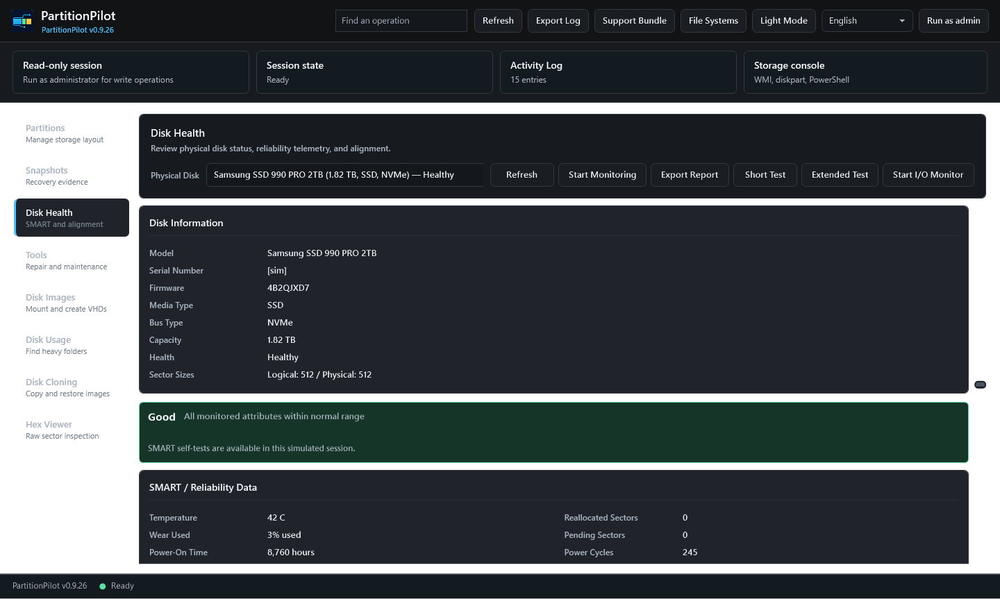
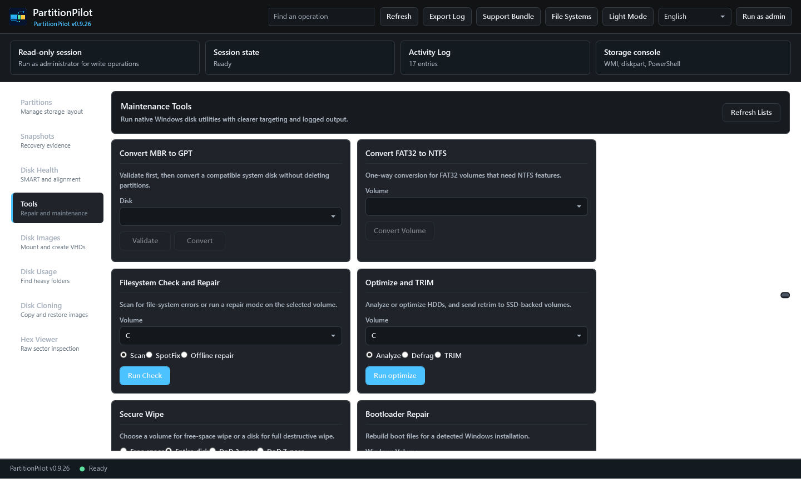
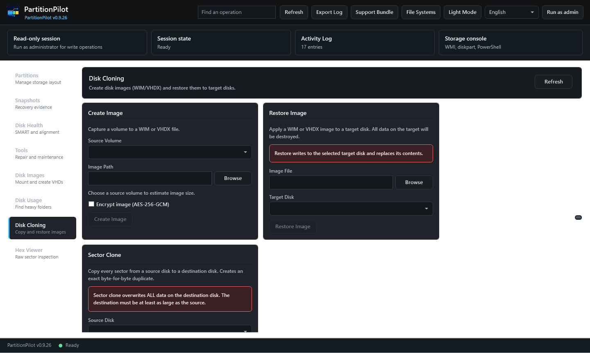

<p align="center">
  
</p>

<h1 align="center">PartitionPilot</h1>

<p align="center">
  Plan, inspect, and recover Windows storage without handing control to a black box.
</p>


[Download the latest release](https://github.com/SysAdminDoc/PartitionPilot/releases/latest) · [Read the safety model](#safety-model) · [Use the CLI](#command-line)

PartitionPilot brings disk layout, drive health, recovery evidence, and imaging into one Windows workspace. Changes sit in a pending plan until you apply them. The same safeguards are available through the included `pp.exe` command-line tool.



## Why use it

Windows Disk Management is fine for a quick format. It gets harder to trust when a task involves several disks, a damaged layout, BitLocker, or a change that needs to be repeated on another machine.

PartitionPilot keeps the evidence visible:

- A proportional disk map sits above the exact partition table.
- Destructive work is queued, reviewed, and identity-checked before execution.
- Recovery snapshots and image manifests record what was captured.
- Health data combines Windows storage APIs with clear advisory thresholds.
- GUI and CLI workflows share the same planning and safety services.
- Simulation mode provides realistic product data without touching a real disk.

| Question | PartitionPilot's answer |
| --- | --- |
| What will change? | A pending operations queue shows the plan before anything runs. |
| Is this still the same disk? | Size, serial, path, bus, and unique ID checks guard restore and clone work. |
| Can I inspect first? | Restore, layout, and recovery commands default to a dry run. |
| Where did the result come from? | Logs, manifests, checksums, and redacted support bundles preserve evidence. |

## See the real product

These screens come from the production WPF interface running against PartitionPilot's built-in simulated disks. No mock dashboard was substituted for the app.

<table>
  <tr>
    <td width="50%">
      <br>
      <sub><strong>Disk health.</strong> SMART readings, alignment, temperature, wear, and self-test controls in one view.</sub>
    </td>
    <td width="50%">
      <br>
      <sub><strong>Maintenance tools.</strong> File-system repair, TRIM, conversion, wipe, boot repair, and benchmarking with explicit targets.</sub>
    </td>
  </tr>
  <tr>
    <td colspan="2">
      <br>
      <sub><strong>Imaging and cloning.</strong> Create or restore WIM and VHDX images, encrypt captures, and run sector-level clones behind clear warnings.</sub>
    </td>
  </tr>
</table>

## Core workflows

### Plan partition changes

- Create, delete, format, resize, extend, split, hide, or assign a drive letter.
- Initialize RAW disks as GPT.
- Review 4K alignment and unsupported file-system limits before native tools run.
- Keep several changes in one pending queue, then apply them in order.

### Check drive health

- Read NVMe SMART log page `02h` and the ATA Device Statistics log through documented Windows storage calls.
- Review temperature, spare capacity, media errors, sector counts, total writes, and vendor attributes.
- Track SMART history and surface degradation trends.
- Run `smartctl` short or extended self-tests when the selected device supports them.

### Recover a layout

- Save point-in-time partition snapshots with JSON export.
- Compare a snapshot with the current disk before building a restore plan.
- Scan for lost partitions in fast mode or use a resumable sector-by-sector deep scan.
- Block restore when the target no longer matches the recorded disk identity.

### Work with images and clones

- Mount ISO, VHD, and VHDX images.
- Create VHD or VHDX virtual disks from the desktop interface.
- Capture volumes to WIM or VHDX from a VSS snapshot.
- Encrypt image containers with AES-256-GCM.
- Validate sidecar manifests and image hashes before a target is cleared.
- Audit Windows bootability after restore or clone work.

### Diagnose and maintain Windows storage

- Explain the file that is holding back a volume shrink.
- Convert MBR to GPT, repair a file system, send TRIM, or run a surface test.
- Create Dev Drives and run DiskSpd-backed benchmarks.
- Export a support bundle that redacts serial numbers and user paths.

## Install

PartitionPilot supports 64-bit Windows 10 and Windows 11.

1. Open the [latest release](https://github.com/SysAdminDoc/PartitionPilot/releases/latest).
2. Choose `PartitionPilot-0.9.25-Setup.exe` for normal installation, or download the portable ZIP.
3. Start in the standard read-only session for inspection. Use **Run as admin** only when a write operation needs elevation.

The current release is not Authenticode-signed because no signing certificate is available. Windows may show SmartScreen the first time it runs. Each release publishes GitHub's server-side digest, and the project also produces SHA-256 manifests during local packaging.

### What the installer includes

- `PartitionPilot.exe`, the desktop app.
- `pp.exe`, the scriptable CLI.
- A self-contained .NET 10 runtime.
- The Velopack update channel used by installed copies.

## Command line

The included CLI uses the same core services as the desktop app.

```powershell
pp disks --json
pp partitions --disk 0
pp health --json
pp shrink-blockers --drive C
pp recovery-scan --disk 1 --mode fast
pp diagnostics
```

Destructive commands print a plan first. Add `--apply` only after review.

```powershell
pp restore-snapshot --file .\snapshot.json --disk 2
pp apply-layout --file .\layout.json --disk 2
```

Both commands above are dry runs. Applying either plan requires `--apply`, then a typed confirmation.

### Exit codes

| Code | Meaning |
| ---: | --- |
| 0 | Completed successfully |
| 1 | Failed after execution began; the target may be partially written |
| 2 | Completed with warnings |
| 3 | Invalid command or argument |
| 4 | Target not found |
| 5 | A required precondition failed |
| 6 | A safety guard blocked the operation before writing |
| 7 | Cancelled at confirmation |
| 130 | A deep recovery scan was interrupted and saved its resume state |

Run `pp` without arguments to see every command. JSON output is available for automation.

## Safety model

PartitionPilot handles operations that can erase data. It treats that as the product's central design constraint.

- Write actions require elevation. Inspection works in a standard session.
- Partition edits stay pending until you apply the queue.
- Wipe, restore, and clone flows require a fresh pre-destruction snapshot.
- Disk identity is checked again immediately before execution.
- BitLocker and Storage Spaces preflights can stop an unsafe plan.
- Unsupported file-system operations are rejected before DiskPart or PowerShell starts.
- Long-running work can be cancelled and writes structured audit records.

Keep a current backup before changing partition boundaries, restoring an image, or wiping a device. No partition manager can replace a backup.

## No kernel driver

PartitionPilot installs no kernel driver.

Its direct NVMe and SATA health reads use `IOCTL_STORAGE_QUERY_PROPERTY`, a documented Windows interface. LibreHardwareMonitor is included for additional vendor attributes, but PartitionPilot enables only its storage category. The vulnerable WinRing0 path used for CPU, GPU, and motherboard sensors is not loaded.

`smartctl` is optional. PartitionPilot reports its path and version when it is available, and explains what is missing when it is not.

## Privacy and network use

Disk inventory, SMART readings, snapshots, and activity logs stay on the machine. PartitionPilot does not send drive data to an analytics service.

Network access is used for two explicit jobs:

- Checking GitHub Releases for an app update.
- Downloading Microsoft's DiskSpd utility when you choose a benchmark and it is not already installed.

Support bundles are created locally and redact user paths plus device serials before export.

## Build from source

Requirements:

- Windows 10 or Windows 11.
- .NET 10 SDK.
- Administrator access only for tests that exercise real storage writes.

```powershell
git clone https://github.com/SysAdminDoc/PartitionPilot.git
cd PartitionPilot
dotnet build .\src\PartitionPilot\PartitionPilot.csproj -c Release -m:1
dotnet test .\tests\PartitionPilot.Tests\PartitionPilot.Tests.csproj -c Release
```

Publish the desktop app and CLI:

```powershell
dotnet publish .\src\PartitionPilot\PartitionPilot.csproj -c Release -r win-x64 --self-contained true
dotnet publish .\src\PartitionPilot.Cli\PartitionPilot.Cli.csproj -c Release -r win-x64 --self-contained true
```

The release build also creates the Velopack setup program, full update package, release index, portable ZIP, and checksum manifests.

## Reproduce the screenshots

The capture tool starts the production interface on a private Windows desktop, enables built-in simulated disks, forces software rendering, and saves the same four marketing states used above. It refuses to run its worker on the interactive desktop.

```powershell
dotnet run --project .\tools\PartitionPilot.MarketingCapture\PartitionPilot.MarketingCapture.csproj -c Release -- --output .\assets\screenshots
```

## Languages

The interface includes English, German, Spanish, French, and a pseudo-locale for translation review. Language changes apply immediately and are remembered between runs.

## License

PartitionPilot is available under the [MIT License](LICENSE).
